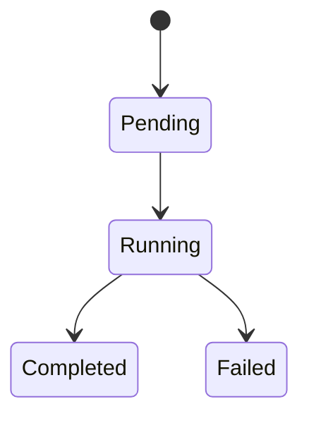
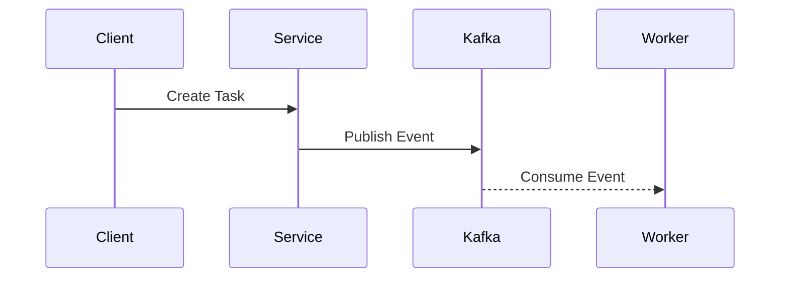

# Phase 2 — Runtime Semantics & Data Modeling

# 1. Runtime Overview

Brief summary of runtime behavior.

---

# 2. Lifecycle & State Machine

## State Diagram

Example:



---

## States

| State | Meaning | Terminal |
|---|---|---|
| Pending | Waiting for execution | no |
| Running | Currently executing | no |
| Completed | Finished successfully | yes |
| Failed | Execution failed | yes |

---

## State Transition Rules

| Transition | Allowed | Notes |
|---|---|---|

---

## Invalid Transitions

| Transition | Why Invalid |
|---|---|

---

# 3. Retry Semantics

Example:

| Flow | Retryable | Idempotent | Ordering Sensitive |
|---|---|---|---|
| task creation | yes | yes | no |
| payout execution | limited | required | yes |

---

## Actual Retry Rules

| Flow | Retryable | Idempotent | Ordering Sensitive |
|---|---|---|---|

---

# 4. Replay Semantics

| Flow | Replay Allowed | Notes |
|---|---|---|

---

# 5. Failure Semantics

| Failure Scenario | Behavior | Recovery Strategy |
|---|---|---|

---

# 6. Event Flow

Example:



---

## Actual Event Flow

```mermaid
sequenceDiagram
```

---

# 7. Async Flow Overview

| Flow | Trigger | Async Boundary |
|---|---|---|

---

# 8. Consistency Boundaries

| Boundary | Consistency Model |
|---|---|

---

# 9. Ownership Boundaries

| Resource | Owner | Replicated | Cross-Service Writes Allowed |
|---|---|---|---|

---

# 10. Persistence Responsibilities

| Storage | Purpose | Owner |
|---|---|---|

---

# 11. Runtime Risk Analysis

| Risk | Why It Matters | Mitigation |
|---|---|---|

---

# 12. Data Model Summary

| Entity / Aggregate / Workflow Object | Purpose |
|---|---|

---

# 13. Operational Concerns

| Concern | Impact |
|---|---|

---

# 14. Unresolved Runtime Questions

| Question | Impact |
|---|---|

---

# 15. Anti-Patterns

Avoid:

- giant ER diagrams hiding ownership
- APIs without retry semantics
- missing timeout behavior
- undefined replay behavior
- undefined ownership boundaries
- hidden consistency assumptions

---

# 16. Phase Gate

Before entering Phase 3, confirm:

- lifecycle semantics
- retry semantics
- replay semantics
- ownership semantics
- consistency semantics
- event behavior