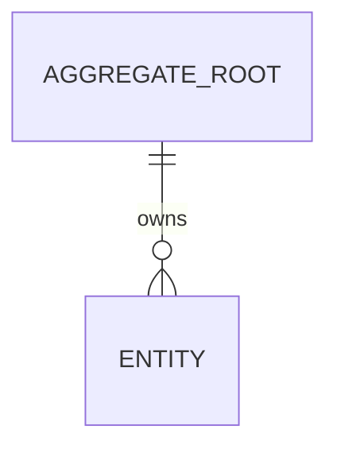
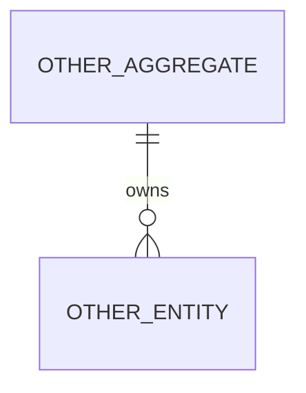

# {spec_title} 后端工程 Spec

## 1. Spec 元信息

| 字段 | 内容 |
|---|---|
| 类型 | feature / module / microservice |
| 业务域 |  |
| 系统 |  |
| 服务/模块 |  |
| 状态 | draft / review / approved |
| 版本 | v1.0.0 |

---

## 2. 输入材料分析

### 2.1 PRD/材料摘要

- 来源：
- 核心目标：
- 关键需求：
- 明确约束：

### 2.2 后端相关提取

- API/RPC/事件：
- 数据模型：
- 状态流：
- 异步任务：
- 权限与审计：
- 非功能需求：

### 2.3 冲突点

| 编号 | 冲突描述 | 原始表述 | 影响 | 处理状态 |
|---|---|---|---|---|
| C-001 |  |  |  | pending |

### 2.4 模糊点与缺失信息

| 编号 | 问题 | 影响范围 | 建议默认方案 | 状态 |
|---|---|---|---|---|
| Q-001 |  |  |  | pending |

### 2.5 需求澄清记录

| 编号 | 问题 | 决策 | 决策依据 | 确认人/来源 |
|---|---|---|---|---|
| D-001 |  |  |  |  |

---

## 3. 背景与目标

### 3.1 背景

### 3.2 目标

### 3.3 非目标

---

## 4. 范围与职责边界

### 4.1 范围内

### 4.2 范围外

### 4.3 职责边界

| 能力/流程 | 本服务/模块负责 | 上游负责 | 下游负责 | 待确认 |
|---|---|---|---|---|
|  |  |  |  |  |

---

## 5. 系统上下文

### 5.1 上游系统

### 5.2 下游系统

### 5.3 外部依赖

### 5.4 现有工程上下文

- 代码路径：
- 相关文档：
- 相关 API/RPC：
- 相关数据表：

---

## 6. 服务/模块职责

> `module` 和 `microservice` 必填，`feature` 可简写。

### 6.1 单一职责

### 6.2 数据所有权

### 6.3 与现有服务的关系

---

## 7. 架构设计

> `microservice` 必填；`feature` 和 `module` 可描述局部架构。

### 7.1 组件划分

### 7.2 调用链路

### 7.3 同步/异步策略

---

## 8. API/RPC/事件契约

### 8.1 API/RPC 列表

| 编号 | 名称 | 类型 | 调用方 | 说明 |
|---|---|---|---|---|
| API-001 |  | HTTP/RPC/Event/Task |  |  |

### 8.2 请求/响应

```text
TODO: define request and response contract
```

### 8.3 错误码与错误语义

| 错误码 | 触发条件 | 调用方可见 | 处理建议 |
|---|---|---|---|
|  |  | 是/否 |  |

---

## 9. 数据模型与存储设计

> 默认采用 DDD 视角建模，但不机械拆域。若一个领域上下文即可收敛模型，应明确说明“不拆分”的原因。

### 9.1 领域划分与建模决策

| 领域/限界上下文 | 职责 | 是否独立拆分 | 决策理由 |
|---|---|---|---|
|  |  | 是/否 |  |

### 9.2 聚合、实体与值对象

| 类型 | 名称 | 所属领域 | 职责 | 关键不变量 |
|---|---|---|---|---|
| 聚合根 |  |  |  |  |
| 实体 |  |  |  |  |
| 值对象 |  |  |  |  |

### 9.3 领域服务与领域事件

| 类型 | 名称 | 触发/调用时机 | 说明 |
|---|---|---|---|
| 领域服务 |  |  |  |
| 领域事件 |  |  |  |

### 9.4 分域 ER 图

> 涉及持久化数据时必须提供。默认按领域/限界上下文拆成多个小 ER 图，避免一个大图混淆职责边界。
> 若模型很小且只有一个内聚领域，可以只给一个 ER 图，但必须说明不拆分原因。

#### 9.4.1 {领域A} ER 图



#### 9.4.2 {领域B} ER 图（如适用）



#### 9.4.3 跨域引用说明

| 来源领域 | 来源对象 | 目标领域 | 目标对象 | 引用方式 | 说明 |
|---|---|---|---|---|---|
|  |  |  |  | ID 引用/事件同步/只读视图 |  |

### 9.5 实体到表映射

| 领域对象 | 对象类型 | 表名 | 所有权 | 说明 |
|---|---|---|---|---|
|  | 聚合根/实体/值对象 |  | 本服务/外部系统 |  |

### 9.6 表结构变更

```sql
-- TODO: add DDL or migration summary
```

### 9.7 索引、约束与数据一致性

### 9.8 数据迁移与兼容

---

## 10. 核心流程

### 10.1 主流程

1. 
2. 
3. 

### 10.2 异常流程

### 10.3 边界场景

---

## 11. 状态机、幂等与并发控制

### 11.1 状态定义

| 状态 | 含义 | 是否终态 |
|---|---|---|
|  |  | 否 |

### 11.2 状态流转

| 当前状态 | 事件/操作 | 目标状态 | 约束 |
|---|---|---|---|
|  |  |  |  |

### 11.3 幂等策略

### 11.4 并发与事务边界

---

## 12. 权限、审计与安全

### 12.1 权限模型

### 12.2 审计日志

### 12.3 敏感数据处理

---

## 13. 配置、部署与运行

> `microservice` 必填，其他模式按需填写。

### 13.1 配置项

| 配置项 | 默认值 | 说明 | 是否敏感 |
|---|---|---|---|
|  |  |  | 否 |

### 13.2 部署形态

- API 服务：
- Worker：
- Consumer：
- Cron：

### 13.3 健康检查

---

## 14. 可观测性

### 14.1 日志

### 14.2 指标

| 指标 | 类型 | 标签 | 用途 |
|---|---|---|---|
|  | counter/gauge/histogram |  |  |

### 14.3 告警

### 14.4 排障入口

---

## 15. 迁移、灰度与回滚

### 15.1 数据迁移

### 15.2 灰度策略

### 15.3 回滚策略

---

## 16. 测试计划

### 16.1 单元测试

### 16.2 集成测试

### 16.3 契约测试

### 16.4 验收标准

| 编号 | 验收项 | 验证方式 |
|---|---|---|
| AC-001 |  |  |

---

## 17. 风险与待确认问题

### 17.1 风险

| 编号 | 风险 | 影响 | 缓解措施 |
|---|---|---|---|
| R-001 |  |  |  |

### 17.2 待确认问题

| 编号 | 问题 | 影响 | 负责人/来源 |
|---|---|---|---|
| O-001 |  |  |  |
